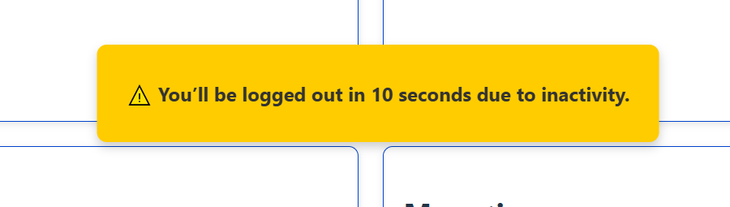
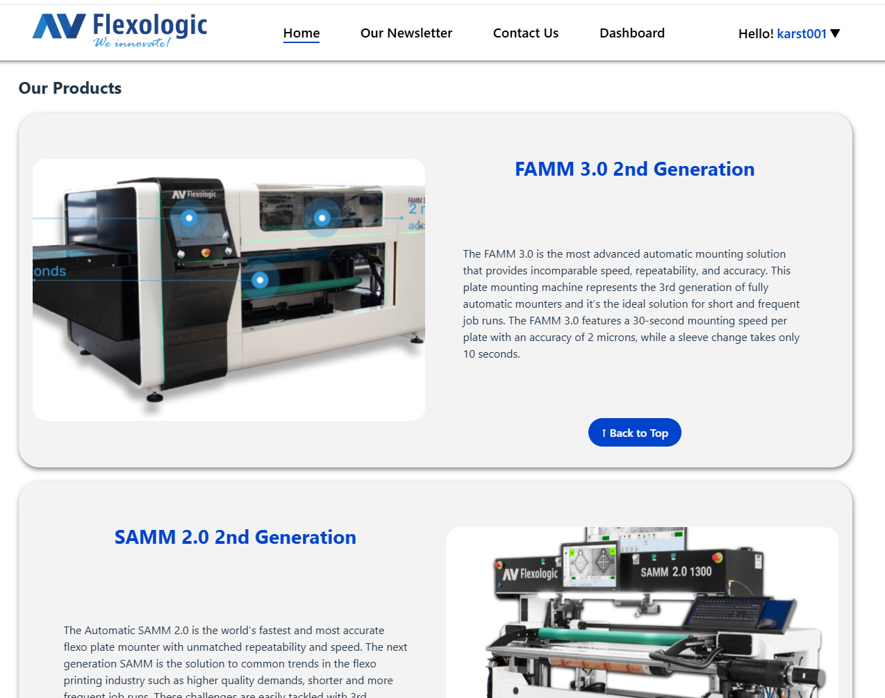
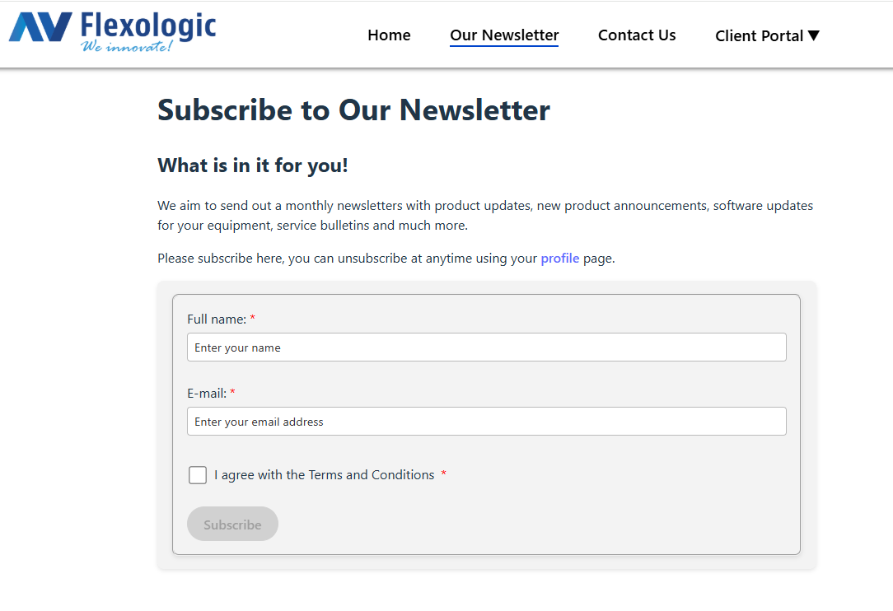
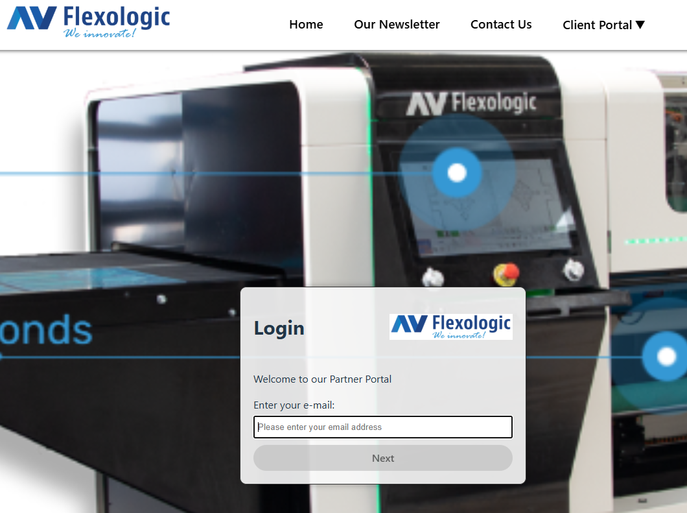
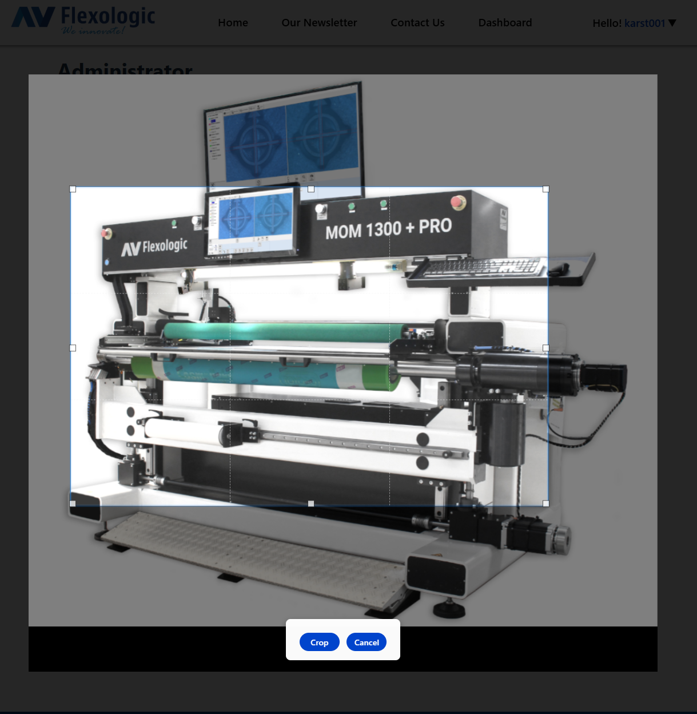
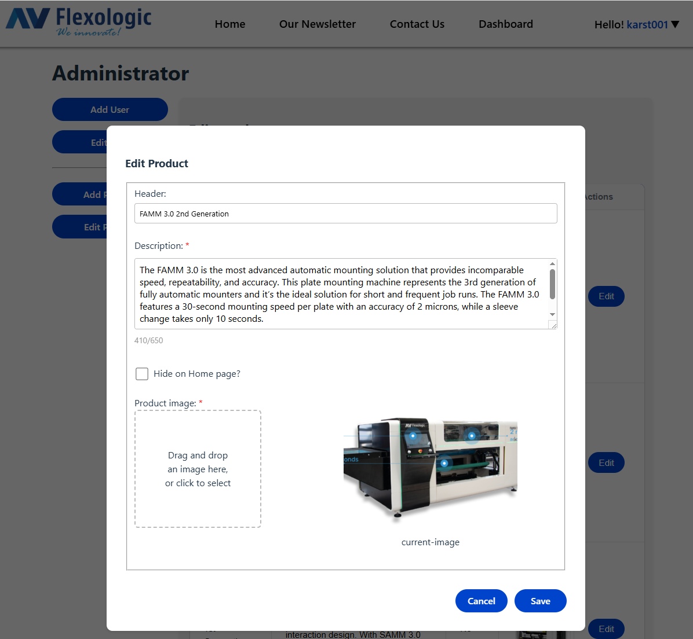

# Opdrachtbeschrijving
[Voorwoord](#voorwoord)
1. [Projectbeschrijving](#1-projectbeschrijving)
2. [Systeem vereisten](#2-systeem-vereisten)
3. [Installatie en configuratie](#3-installatie-en-configuratie)
4. [Applicatie starten in Development](#4-applicatie-starten-in-development)
5. [Build to deploy](#5-build)
6. [Gebruikersrollen](#6-gebruikersrollen)
   - [Login gegevens](#admin-login-gegevens)
7. [Testen](#7-testen) 
9. [Gebruikte technologieën](#8-gebruikte-technologieën)
9. [Documentatie](#9-documentatie)
10. [Afsluiting](#10-afsluiting)
11. [Test sceanrio's](#11-testScenarios)
    - [Start website](#start-website-in-webstorm)
    - [Our Newsletter](#our-newsletter)
    - [Contact Us](#contact-us)
    - [Client Portal](#Client-portal)
    - [Add new user](#add-new-user)
    - [Dashboard](#dashboard)
    - [Switch to Admin user](#switch-to-admin-user)
    - [Edit users](#edit-users)
    - [Add Products](#add-products)
    - [Automatisch uitloggen](#automatisch-uitloggen)
12. [Scherm afbeeldingen ter illustratie](#12-scherm-afbeeldingen-ter-illustratie)
    - [Home pagina & Producten](#Homepagina-met-video-en-producten)
    - [Nieuwsbrief pagina](#Nieuwsbrief)
    - [Contact Us pagina](#Contact-Us)
    - [Login pagina](#De-Login-pagina)
    - [Wachtwoord pagina](#Wachtwoord-pagina)
    - [Old_Dashboard pagina](#Dashboard)
    - [Jobs, Sleeves, Plates](#Jobs-Sleeves-Plates)
    - [Sales Data by month](#Jobs-Sleeves-Plates-Sales-data-by-Month)
    - [Avg. Time Between Jobs](#Time-Between-Jobs)
    - [Administrator pagina](#Admininstrator-pagina)
    - [Nieuwe gebruikers aanmaken](#Nieuwe-gebruikers-aanmaken)
    - [Bestaande gebruikers wijzigen](#Bestaande-gebruikers-wijzigen)
    - [Nieuw product aanmaken](#Nieuw-product-aanmaken)
    - [Bestaand product wijzigen](#Bestaand-product-wijzigen)
# Voorwoord
Ik was al een heel eind met de eindopdracht en aangezien ik nog niet echt gewend ben aan Git Hub had ik dus geen PR en merges gemaakt...
Nieuw project begonnen en stapsgewijs de bestaande structuur en content van het oude project naar dit project gecopieerd dus het lijkt dat ik superman ben en binnen enkele uren heel veel bestanden e.d. gemaakt heb wat dus niet het geval is.

# 1. Projectbeschrijving
Dit project betreft een Single Page Application (SPA) gebouwd met React.
De applicatie bestaat uit een publieke website en een beveiligde omgeving voor gebruikers en administrators, waarin gebruikersspecifieke data wordt weergegeven via een dashboard.

Voor een uitgebreide beschrijving van functionaliteit, architectuur en gemaakte keuzes wordt verwezen naar:

- het Functioneel Ontwerp
- het Verantwoordingsdocument


# 2. Systeem vereisten
Om dit project lokaal te kunnen draaien is het volgende vereist:

#### IDE
Bijvoorbeeld:
   - WebStorm
   - Visual Studio Code

#### Node.js 
  - Versie: v18.x of hoger 
  - (Node.js wordt geleverd inclusief NPM)

#### NPM

Wordt automatisch meegeleverd met Node.js

Controleer of Node en NPM correct zijn geïnstalleerd met:
```
node -v
npm -v
```

# 3. Installatie en configuratie
### 3.1 Repository clonen

Clone de repository naar een lokale map:
```
git clone <repository-url>
cd dashboard
```
'dashboard' is de project map van de applicatie.

### 3.2 Dependencies installeren

Installeer alle benodigde packages via NPM:
```
npm install
```
Hiermee worden alle dependencies geïnstalleerd zoals gedefinieerd in `package.json.`

### 3.3 Environment configuratie

Deze applicatie maakt gebruik van een `.env` bestand waarin de URL naar de backend wordt opgeslagen, dit `.env` is standaard niet meegeleverd.

- Maak in de root map (op dezelfde hoogte als de .gitignore en package.json) een .env file aan.
- Voeg het woord .env toe aan het .gitignore bestand
- Open de .env en plaats daar de volgende keys:
- VITE_BASE_URL= {de waarde van de base URL kun je vinden in document 'Func tioneel Ontwerp - Herkansing.docx'}
- Run het commando npm run build in de terminal; dit is nodig omdat het env bestand gewijzigd is
- stop nu de development server met CNTR + C

# 4. Applicatie starten in development
Start de applicatie in development mode met:

```
npm run dev
```
De applicatie wordt vervolgens gestart op:
```
http://localhost:5173
```
(Exacte poort kan verschillen afhankelijk van de configuratie.)

Tijdens development wordt gebruik gemaakt van hot reload, zodat wijzigingen direct zichtbaar zijn in de browser.

# 5. Build
Voor het maken van een productiebuild kan het volgende commando worden gebruikt:
```
npm run build
```
Dit commando:

- bundelt en optimaliseert de applicatie
- voert code splitting toe
- genereert een productieklare versie van de applicatie

De build-output wordt geplaatst in de map:
```
/dist
```
Deze map kan worden gebruikt voor deployment naar een webserver.


# 6. Gebruikersrollen
#### - Bezoeker
  - Toegang tot publieke pagina’s

#### - Gebruiker
  - Toegang tot persoonlijk dashboard en profielpagina

#### - Administrator
  - Toegang tot beheerfunctionaliteit zoals gebruikers- en productbeheer

Authenticatie en autorisatie zijn volledig afgehandeld via de frontend en backend.

### Admin login gegevens
Om in te kunnen loggen volg deze stappen:
- navigeer naar `Client Portal > Sign In`
- login met `admin@test.com` en `Welc0me64!@`
- in hoofdstuk 11 van dit document zijn diverse test scenario's te vinden


# 7. Testen

Testen kunnen worden uitgevoerd door middel van:

- handmatige functionele tests
- validatie van gebruikersscenario’s
- controle van foutafhandeling en edge cases

De testscenario’s en de te verwachten resultaten kunnen gevonden worden in hoofdstuk 11 van dit document.


# 8. Gebruikte technologieën

- React
- React Router
- Gridjs-react
- Recharts
- React Cropper
- NPM
- JavaScript (ES6+)

Een uitgebreide onderbouwing van deze keuzes is opgenomen in het verantwoordingsdocument.

# 9. Documentatie

Voor verdere verdieping wordt verwezen naar:

- Functioneel Ontwerp – beschrijving van eisen, use cases en ontwerp
- Verantwoordingsdocument – onderbouwing van technische keuzes, architectuur en leerpunten

# 10. Afsluiting

Dit project is ontwikkeld in het kader van een studieopdracht.

De focus ligt op structuur, veiligheid, onderhoudbaarheid en gebruikerservaring zoals geleerd tijdens de front-end studie.


## 11. TestScenarios
Test scenario’s voor de Dashboard applicatie

### Start website in Webstorm
      
- a.	`npm run dev`
- b.    De homepagina zal een video weergeven en animatie vertonen met tekst en een knop ‘Products’
- b.	De producten kunnen op twee manieren worden weergegeven: klik op knop `Products` of scroll naar beneden
- c.	Tijdens het scrollen zal de video zal langzaam naar de achtergrond verdwijnen en de producten zullen geanimeerd weergegeven worden
- d.	Klik op `Back to top` om weer naar de video te gaan


### Our Newsletter

- a.	Klik op ‘Our Newsletter’
- b.    Als je bent ingelogd dan wordt het e-mailadres al ingevuld, als je niet bent ingelogd dan moet je naam en een `geldig emailadres waar je toegang toe hebt` invullen, akkoord gaan met de voorwaarden en op `Subscribe` te klikken
- c.	Een geautomatiseerde email wordt via de API naar je verzonden ter bevestiging
- d.	Zodra je je hebt aangemeld voor de nieuwsbrief verdwijnt de knop `Our Newsletter` in de navigatie balk
- e.	Als je al bent ingeschreven en je probeert het opnieuw met hetzelfde email adres dan zie je deze melding 'This emailaddress is already subscribed'.
- f.	Verbreek nu de verbinding met het internet, na een paar seconden zal er aan melding gaan knipperen ‘Internet connection not available’
- g.	Vul een naam en emailadres in en ga akkoord met de voorwaarden terwijl het internet nog uitstaat. Je zult zien dat de ‘Subscribe’ knop `disabled` blijft
- h.	Schakel nu internet weer in, wacht een paar seconden, `Subscribe` wordt weer `enabled`
- i.	De live controle van de `internet status` is en functie die door de gehele website werkt

### Contact Us
- a.    Klik op ‘Contact Us’
- b.	Vul alle velden in
- c.    Voor het emailadres vul je een `geldig emailadres in waar je toegang toe hebt`
- d.	Controleer of email gevalideerd wordt
- e.	Klik op `Send Message`
- f.	Een geautomatiseerde email wordt via de API naar je verzonden ter bevestiging

### Client Portal
- a.    Klik op ‘Client Portal’ --> ‘Sign In’
- b.	Vul voor emailadres `test@test.com` in, deze bestaat nog niet, er zal een foutmelding ontstaan ‘Unknown email’
- c.	Probeer opnieuw met `testatest.nl.` -> foutmelding ‘Invalid email format’
- d.	Probeer opnieuw met `admin@test/nl` -> foutmelding ‘Invalid email format’
- e.	Probeer opnieuw met `admin@test.com`
- f.	Wachtwoord: `Welc0me64!@`  (geen hoofdletter O maar een nul)
- g.	Omdat dit de administrator is wordt de administrator pagina weergegeven, daarna kun gebruikers toevoegen, bestaande gebruiker(s) wijzigen, producten toevoegen of wijzigen

### Add new user

- a.    Klik op `Add User`	
- b.    Vul `karst001` in en tab naar volgend veld -> foutmelding ‘This username is already in use’   
- c.    Dezelfde validatie geldt voor emailadres, als deze al bestaat zoals `admin@test.com`
- d.    Vul alle velden in, `LET OP gebruik een emailadres waar je toegang toe hebt`, een nep emailadres als `123test@gmail.com` werkt niet want je krijgt zo een email op dat adres waarin een link is verwerkt om de registratie van je nieuwe user te voltooien
- e.    `LET OP: Zonder de registratie te voltooien met een geldig emailadres kun je niet als deze gebruiker inloggen.`
- g.	Zodra de email binnen komt klik op de link die je naar de websiote brengt, vul nu een emailadres in dat anders is wat je hiervoor had opgegeven, bijvoorbeeld `123test@hotmail.com` -> fout ‘The email address you entered is not correct.’
-       Deze foutmelding klopt want de website verwacht een emailadres welke gekoppeld is aan de link die je zojuist had ontvangen
- i.	Vul nu het juiste emailadres in, het emailadres waar je de verificatie email in had ontvangen, klik `Next`
- j. 	Je komt nu op `Set new Password` en vul wachtwoord in, er zijn instructies te zien waaraan je wachtwoord moet voldoen
- k.	Maak wachtwoord aan en bevestig, een welkom bericht wordt weergegeven, en als niet admin gebruiker zie je daarna direct je dashboard
- l.	In de navigatie balk klik nu op `Hello! {gebruikernaam}` -> `Profile`
- m.	Hier kun je je wachtwoord wijzigen en ook inschrijven voor de nieuwsbrief of als je al ingeschreven bent, weer uitschrijven
- n.	Als je je wachtwoord wijzigt wordt ook een controle uitgevoerd of het huidige wachtwoord correct is, zodra wachtwoord gewijzigd is zal de API een bevestiging emailen

### Dashboard
Ga terug naar `Dashboard`, iedere 5 seconden wordt deze aangepast met fictieve data
- a.	Klik op `Jobs, Sleeves Plates`, een overlay pagina wordt zichtbaar, klik op `Mar 2026` bijvoorbeeld en nog een overlay pagina die dynamische routing gebruikt `(..dashboard/jobs-sleeves-plates/{month})` wordt zichtbaar. Door tijdsgebrek is dit nu alleen fictieve data
- b.	Sluit menu en klik op een andere maand, andere data wordt nu weergegeven
- c.	Terwijl deze popup menu’s open zijn wordt het Dashboard niet ge-refreshed in de achtergrond
- d.	Ga terug naar `Dashboard`, klik op ‘Time Between Jobs’ of ‘Time Between Sleeves’, verschillende grafieken worden weergegeven

### Switch to Admin user
- a.    Loguit met je huidige gebruiker
- b.	Login met `admin@test.com` en `Welc0me64!@`
- c.	Ga naar Hello! {gebruikernaam} -> Administrator

### Edit users
- Klik nu op `Edit users`, je ziet `karst001` en de gebruiker die je net hebt aangemaakt, nu kun je de rechten wijzigen en opslaan middels `Update User`.
- Een gebruiker die op `Enabled` stond kun je uitzetten, hierna kan de gebruiker niet meer inloggen. 
- `Er moet minstens één Admin gebruiker zijn en 'karst001' is toegewezen als Superuser, probeer deze maar eens op Disabled te zetten`  Zonder één Admin gebruiker zouden er immers geen wijzigingen meer kunnen worden gedaan op gebruikers rechten.

### Add Products
Er staat maar 1 product op de homepagina, voeg er nog één of meerdere aan toe
- a.	Zie folder `..\src\testAssets` binnen dit project, daar vindt je een aantal voorbeeld plaatjes en tekst in `ProductInformation.txt`
- b.    Klik op `Add Product`, ga naar de folder `..\src\testAssets` copieer de tekst uit `ProductInformation.txt` en upload de bijbehorende foto
- b.	Je kunt in-en uit zoomen op de foto met scrollen van de muis, en croppen, klik op `Apply`
- c.	Klik op `Create Product`, de data wordt nu in de database opgeslagen

 
Ga nu naar `Home`, nu zijn er twee producten
- a.	Ga terug naar `Hello! {gebruikernaam}` -> Administrator
- b.	Voeg de andere twee producten toe, controleer homepagina, er zijn er nu vier
- c.	In `Hello! {gebruikernaam}` -> Administrator ga naar `Edit Product`
- d.	Klik op `Edit` naast 1 van de producten
- e.	Klik op `Hide on Home page?` Klik daarna op `Save`

Kijk nu op homepagina, dit product is nu niet meer zichtbaar maar blijft wel in de database.

### Automatisch uitloggen
Met de huidige instellingen van 15 minuten is het in de praktijk wellicht te kort en een langere geldigheid van het JWT token kan wenselijk zijn.

Dit kan alsvolgt gewijzigd worden in `../context/AuthContextProvider.jsx`
- const auto_logout_time = 15 * 60 * 1000;      // Auto logout after 15 minutes of inactivity
- const warning_before_signout = 10 * 1000;     // Show warning 10s before logout

Om dit snel te testen: wijzig `const auto_logout_time = 10 * 60 * 1000` naar `const auto_logout_time = 1 * 20 * 1000` en binnen 20 seconden inactief te zijn logt de website uit.

De gebruiker krijgt dan onderstaande melding te zien 10 seconden voordat de tijd is verstreken:




# 12. Scherm afbeeldingen ter illustratie
Zodra website start kom je op de indexpagina


## Homepagina met video en producten:



## Nieuwsbrief:



## Contact Us:


Geregistreerde gebruikers (drukkerijen) hebben een login gekregen.


## De Login pagina:


Nadat het e-mailadres is gevalideerd is in de backend wordt de login `<div>`verborgen en zal het wachtwoord `<div>` worden weergegeven, de gebruiker blijft op de zelfde pagina.


## Wachtwoord invoeren:


Zodra de gebruiker is ingelogd zijn de volgende pagina's ter beschikking:
1. Dashboard
2. Performance Analyse;
    1. Total Jobs/Sleeves/Plates
    2. Average Time Between Jobs
    3. Average Time Between Sleeves

Alle donut grafieken zijn zo ingericht dat de data in relatie tot elkaar is berekend.
- Op 1 job kunnen tussen 1 en 8 sleeevs gemonteerd worden en op iedere sleeve kan maximaal 8 platen gemonteerd worden
- Dus in Today's schedule is 142 bijvoorbeeld het hoogste nummer, 66 staat in verhouding tot sleeves and 23 in verhouding tot 66 zodat niet alle drie de donuts een volle circel weergeven
- Zelfde berekening in Mouting Summary


## Dashboard:


Gedetaileerde informatie per pagina:
1. Dashboard, hier kan de gebruiker het overzicht zien van alle
    1. Jobs die op die dag verwerkt moeten worden (Today's Schedule)
    2. Jobs/Sleeves die gepland staan voor de volgende 2 dagen (dit is gedaan zodat de machine operator kan zien hoe druk het de volgende 2 dagen zal worden)
    3. Forecast van één week vooruit met de geplande orders (met name handig voor Management)
    5. Overzicht van alle verwerkte orders 'YTD Jobs', 'YTD Sleeves', 'YTD Plates' en 'MTD Jobs'


In het linker menu klik op één van de volgende buttons;
## Jobs Sleeves Plates
Dit geeft het onderstaande weer in a grafiek;


## Jobs Sleeves Plates Sales data by Month
Door in bovenstaande grafiek te klikken op bijvoorbeeld Mar 2025 wordt een nieuwe modal pagina geopend met de volgende grafiek


## Time Between Jobs
Geeft de volgende grafiek weer met de gemiddelde tijd in seconden tussen laden van een nieuwe job op de montage machine:


## Time Between Sleeves
Geeft de volgende grafiek weer met de gemiddelde tijd in seconden tussen laden van een nieuwe sleeve op de montage machine:


## Admininstrator pagina.
Als de gebruiker inlogd als Administrator is de volgende pagine beschikbaar;


## Nieuwe gebruikers aanmaken:


## Bestaande gebruikers wijzigen:


## Nieuw product aanmaken:




## Bestaand product wijzigen;




