# Opdrachtbeschrijving
1. [Inleiding](#inleiding)
2. [Beschrijving montage machine](#Hoe-werken-deze-machines)
3. [Koppeling ERP systeem](#Koppeling-ERP-systeem)
4. [Kernfunctionaliteiten van de website](#kernfunctionaliteiten-van-de-website)
5. [API](#api)
6. [Environment variable](#Environment-variable)
7. [Applicatie starten](#applicatie-starten)
8. [Admin login gegevens](#Admin-login-gegevens) 
9. [Beschrijving website](#applicatie-starten)
10. [Home pagina - producten](#Landings-pagina-producten)
11. [Nieuwsbrief pagina](#Nieuwsbrief)
12. [Contact Us pagina](#Contact-Us)
13. [Login pagina](#De-Login-pagina)
14. [Wachtwoord pagina](#Wachtwoord-pagina)
15. [Dashboard pagina](#Dashboard)
16. [Jobs, Sleeves, Plates](#Jobs-Sleeves-Plates)
17. [Sales Data by month](#Jobs-Sleeves-Plates-Sales-data-by-Month)
18. [Avg. Time Between Jobs](#Time-Between-Jobs)
19. [Administrator pagina](#Admininstrator-pagina)
20. [Nieuwe gebruikers aanmaken](#Nieuwe-gebruikers-aanmaken)
21. [Bestaande gebruikers wijzigen](#Bestaande-gebruikers-wijzigen)
22. [Nieuw product aanmaken](#Nieuw-product-aanmaken)
23. [Bestaand product wijzigen](#Bestaand-product-wijzigen)
24. [Weergave foutmeldingen](#Foutmeldingen)

## Voorwoord.
Ik was al een heel eind met de eindopdracht en aangezien ik nog niet echt gewend ben aan Git Hub had ik dus geen PR en merges gemaakt...
Nieuw project begonnen en stapsgewijs de bestaande structuur en content van het oude project naar dit project gecopieerd dus het lijkt dat ik superman ben en binnen enkele uren heel veel bestanden e.d. gemaakt heb wat dus niet het geval is.

## Project inleiding.
Voor een fabrikant van hoogwaardige montage machines voor de flexo-grafische industrie heb ik een verzoek ontvangen om
een webapplicatie te bouwen die data van de montagemachines kan weergeven in diverse grafieken.
De fabrikant levert en installeert deze machines wereldwijd en de eindgebruikers zijn drukkerijen, deze montage machines komen in de zogenaamde 'prepress' te staan om het 
voorbereidende werkt te doen alvorens de rollen 'sleeves' met drukplaten 'plates' de drukpers in gaan. Als opdrachten worden verwerkt op de montage machines noemen we deze 'jobs'.
Deze termen zullen in de website te zien zijn omdat de website in het engels opgelevert dient te worden. 
Een drukpers is een zeer geavanceerde machine die op hoge snelheid afdrukken kan maken op bijvoorbeeld melkartonnen, verpakkingen van koekjes, snoep, vuilniszakken e.d.
Als een drukpers eenmaal start zijn er hoge kosten aan verbonden om de pers te stoppen, te denken valt aan arbeidsloon om de pers weer gereed te maken, afval materialen te verwijderen etc. 
Het is daarom van groot belang dat de montage machines 100% functioneren en de plates uiterst nauwkeuring op de sleeves gemonteerd worden.
De klant wil kunnen zien hoeveel jobs, sleevs & plates er per dag verwerkt zijn. Op de montage machine is ook data aanwezig die laat zien hoe nauwkeurig de plates gemonteerd zijn.
Dit valt buiten de scope voor de opdracht.

Scenario:
Deze fabrikant ontwerpt en fabriceert montage machines zoals onderstaand is weergegeven:

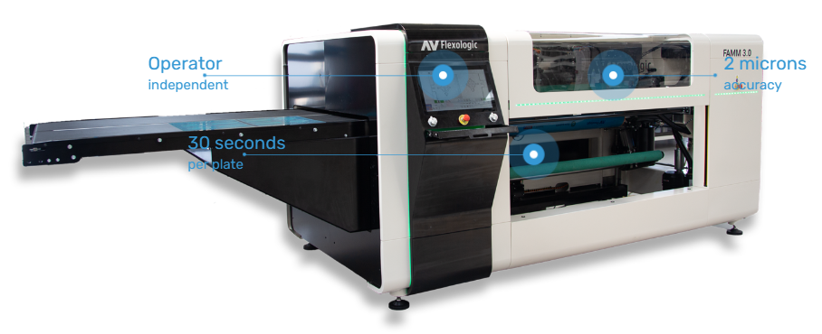

### Hoe werken deze machines.
De flexibele platen worden gemonteerd op sleeves die vervolgens de drukpers ingaan om afdrukken te maken op
melkkartonnen, plastic vuilnis zakken, plastic omhulsels voor frisdranken, plastic verpakking voor snacks etc.

Omdat de consument tegenwoordig hoge eisen stelt aan drukwerk en de verpakking er zeer goed uit moet zien, zijn deze machines ontwikkeld om de flexibele platen met 
een nauwkeurigheid van 2 micron te plakken op de sleeves. Iedere sleeve komt overeen met 1 kleur in de drukpers; de totale combinatie van alle kleuren vormt het uiteindelijke resultaat in de drukpers.

De klant heeft zelf de besturingssoftware ontwikkeld en kan de resultaten van de montagedata uploaden naar een API; zodra een sleeve compleet gemonteerd is wordt de API aangestuurd 
vanuit de machine.
Ook kan de klant data uploaden naar de API als het gaat om de hoeveelheid orders die per dag verwerkt moeten worden, en een forecast van orders voor de komen week.
De machine-operator kan zo zien wat van hem/haar wordt verwacht die dag en dagen daarna. Het managementteam kan dit te allen tijde ook zien, immers het is een website.

Aangezien de te ontwikkelen website de machine niet kan aansturen heeft de klant een API met Microsoft SQL Server backend beschikbaar gesteld waar al veel data in is opgeslagen.
Deze data dient weergegeven te worden in grafieken op de website.

### Koppeling ERP systeem.
Het ERP systeem van de klant zal in de toekomst data aanleveren aan de website m.b.t. de hoeveelheid orders die per dag verwerkt moeten worden.
Aangezien dit ERP systeem nu nog niet beschikbaar is, gebruiken we een JSON dataset met willekeurige waarden die we oploaden naar de API zodat de website de data vervolgens kan 
weergeven in grafieken om de functionaliteit te kunnen weergeven.
In de website wordt iedere 5 sec nieuwe willekeurige data opgehaald voor het dashboard.
Hetzelfde doen we voor het aantal orders voor de volgende week zodat het management team en de machine operators kunnen zien wat de verwachte werkdruk zal zijn.

## Kernfunctionaliteiten van de website;
1. De gehele website is in de engelse taal gemaakt omdat de klant een groot internationaal character en uitstraling heeft, door tijdsgebrek is een meertalige website niet ontwikkeld.
2. Zodra de website gestart wordt komt de gebruiker op een hoofdpagina.  Op de desktop pagina zal altijd een bedrijfsvideo worden weergegeven en daaronder diverse content om het
   bedrijf te beschrijven en wat product informatie. Deze video start automatisch
2. Als er nog geen producten zijn toegevoegd aan de database zal de knop 'Products' op de hoofdpagine niet zichtbaar zijn. Pas als één of meerdere producten zijn opgeslagen worden ze zichtbaar.
3. Zodra je op de hoofdpagina scrollt verdwijnt de video op een gegeven moment om plaats te maken voor de producten. Als de gebruiker weer naar boven scrollt komt de video weer tevoorschijn, terwijl dit gebeurd speelt de video gewoon verder
4. De wens van de klant is dat de menubalk bovenaan de pagina komen te staan, direct daaronder de bedrijsvideo en daaronder de overige  content.  De video is 'sticky' wat betekend dat het altijd boven aan de pagine staat en zodra de
   gebruiker naar beneden scrollt, wordt de overige content weergegeven en de video is dan de achtergrond en de content is dan op de voorgrond te zie en dekt de video af naarmate de gebruiker verder naar beneden scrollt.
   De overige content zal bestaan uit foto's van andere machines en een beschrijving. De foto's en beschrijving moeten om-en-om worden weergegeven, eerst links op de pagina een foto 
   en dan bijbehorende tekst en buttons. Dan tekst van het volgende product en bijbehorende foto, dan weer foto en tekst etc.
   Op de mobiele pagina moet altijd eerst de foto zichtbaar zijn, dan de bijbehorende tekst en buttons.
5. Als je de eerste keer op de hoofdpagina land en naar beneden scrollt, dan zullen de producten één voor één tevoorschijnkomen en ook van links-naar-rechts en rechts-naar-links geanimeerd op de pagina verschijnen. 
   Zodra alle content op de pagina is weergegeven stopt de animate, ook als je weer omhoog- of omlaag scrollt.
6. In het menu is ook een Client Portaal link nodig, deze navigeert de gebruiker naar een Sign In pagina. Alleen de website beheerder kan gebruikers toevoegen aan de database omdat de data
   gerelateerd is aan bepaalde drukkerijen, daarom moet dit via de administrator worden ingesteld anders zou een nieuwe gebruiker toegang kunnen krijgen tot data van andere drukkerijen.
   In de database is een admin gebruiker beschikbaar gesteld, de login gegevens kunnen gevonden worden in hoofdstuk [Administrator login](#Admin-login-gegevens)
    1. De login pagina is zo opgebouwd dat de website gebruiker eerst zijn e-mail adres moet invoeren en dan op 'Next' klikt
    2. Op dat moment wordt een controle uitgevoerd via de API om te kijken of deze gebruiker bestaat, za ja dan volgt de mogelijkheid om een wachtwoord in te voeren. Als het e-mailadres niet bekend is in de database wordt er een foutmelding weergegeven.
    3. Zodra het wachtwoord klopt met de waarde in de database wordt de gebruikeer ingelogd
    4. Een gebruiker die is ingelogd is krijgt toegang tot de machine data van die drukkerij, data van andere drukkerijen is niet zichtbaar
7. Een gebruiker die is ingelogd moet het volgende kunnen zien:
    1. Hoeveel orders er die dag verwerkt moeten worden en hoeveel orders er al verwerkt zijn op die dag.
    2. Wat de komende 7 dagen de verwachte orderhoeveelheid is
    3. Het managementteam moet kunnen zien wat het totaal aantal productieorders is die compleet zijn gemonteerd
    4. De machineoperator moet kunnen zien wat de gemiddelde tijd is in seconden tussen de verschillende jobs; deze data komt direct van de montagemachine af (door tijdsgebrek is de grafiek alleen statische data)
    5. De machineoperator moet kunnen zien wat de gemiddelde tijd is in seconden tussen de verschillende sleeves; deze data komt direct van de montagemachine af (door tijdsgebrek is de grafiek alleen statische data)
8. Aangezien er geen ERP systeem en montage machine van de drukkerij beschikbaar is zal de website een functionaliteit hebben waarme we data kunnen simuleren zodat we de functionaliteit van de website kunnen zien. Iedere 5 seconden wordt er willekeurige data gegenereerd in SQL en via de API opgehaald door de website.
9. Als een Administrator inlogt is er naast de menu balk boven aan de pagina ook nog een tweede menu balk  aan de linker zijde voor het:
    1. Aanmaken nieuwe gebruikers (Add user)
    2. Overzicht van alle gebruikers en mogelijkheid om een gebruiker te deactiveren (Edit user)
    3. Toevoegen van een product, zodra dit product is toegevoegd aan de database, wordt het gelijk zichtbaar op de hoofdpagina (Add Product)
    4. Wijzigen van de producten die al zijn aangemaakt en het verbergen van producten op de Home pagina; stel dat een product niet meer gefabriceerd wordt, dan kan met zo van de website worden  maar in werkelijkheid verbergen we de data gewoon. 
10. Als de Administrator een gebruiker aanmaakt dan:
    1. Zal de API een geautomatiseerde email sturen naar de nieuwe gebruiker, hierin zit een link om in te kunnen loggen en een wachtwoord aan te kunnen maken
    2. In de link is een email adres gecodeerd meegegeven, stel dat de gebruiker deze emailnaar iemand anders zou sturen die dan vervolgens toegang probeert te krijgen dan komt er een foutmelding
    3. De email met uitnodiging om een account aan te maken heeft geen geldigheidsduur, reden is dat als die nieuwe gebruiker bij voorbeeld op vakantie is en het daarna zal proberen in te loggen hij/zij direct vast zit, dat is niet gebruikersvriendelijk. Zodra de nieuwe gebruiker het account heeft aangemaakt wordt dit in de database geregistreerd. Als de gebruiker het nieuwe account heeft aangemaakt en daarna opnieuw de link in de email zou proberen dan wordt deze transactie gewijgerd omdat er vlaggetjes in het profiel worden bijgehouden.
    4. De administrator kan ten allen tijden een account blokkeren via Edit User in het administrator menu
    5. Als de administrator een account heeft aangemaakt en toch besluit dat dit foutief was kan her profiel op non-actief gezet worden door 'New User' uit te zetten en 'Enabled' uit te zetten
11. Iedere website bezoeker kan een zich aanmelden voor een Newsletter, de gebruiker dient een naam en emailadres in te vullen en akkoord te gaan met de voorwaarden. (door tijdsgebrek is er geen module ontwikkeld waar de administrator kan zien wie zich heeft aangemeld, voor nu wordt dit gelogd in de Console.log))
12. Iedere website bezoeker kan een Contact Us formulier invullen (door tijdsgebrek is er geen module ontwikkeld waar de administrator kan zien wie een bericht heeft achtergelaten, voor nu wordt dit gelogd in de Console.log)
13. Als een gebruiker is ingelogd en zich aanmeld voor de Newsletter dan wordt alvast het email adres ingevuld, zo wordt voorkomen dat de gebruiker een Newsletter aanvraagt voor iemand anders. Zodra de Newsletter is aangevraagd verdwijnt de knop 'Newsletter' op de bovenste navigatie balk. Als de gebruiker de inschrijving annuleerd komt deze know weer tevoorschijn.
13. Zodra de gebruiker inlogd kan hij/zij het wachtwoord wijzigen. Het nieuwe wachtoord mag niet hetzelfde zijn als het oude. Stel gebruiker geeft een verkeerd 'Current password' op maar wel een nieuw wachtwoord dan komt er alsnog een foutmelding 'Current password incorrect'.  Ook zijn er regels verbonden aan de kwaliteit van het wachtwoord, zoals lengte, kleine letters, hoofdletters, speciale tekens. Terwijl de gebruiker het wachtwoord voor de eerste keer aanmaakt of nadien wijzigd, dan wordt dit weergegeven tijdens het aanmaken van het wachtwoord.
14. Alle gebruikers van de website hebben toegang tot;
    1. Home pagina
    2. Newsletter pagina
    3. Contact us pagina  
    4. Client Portal met Login pagina, 
       1. Echter alleen geregistreerde gebruikers kunnen inloggen
       2. Alle geregistreerde en gebruikers die zijn ingelogd hebben toegang tot de Dashboard pagina en profiel pagina met daarin wachtwoord wijzigen functionaliteit
    5. Alleen gebruikers met Administrator rechten hebben toegang to de Administrator module


## API.
De backend bestaat uit een Microsoft SQl Server Express Database met Stored Procedures en een een API geschreven in C#, de API kan gevonden worden op  https://softwarethatworks.ca/dashboardapi/
De API key voor deze API is:

De C# code is in de ZIP file meegestuurd.

## Environment variable.
- Maak in de root map (op dezelfde hoogte als de .gitignore en package.json) een .env én een .env.dist file aan.
- Voeg het woord .env toe aan het .gitignore bestand
- Open de .env.dist en zet daar VITE_API_KEY=. De waarde laten we hier leeg. Het is conventie om environment variables in hoofdletters te schrijven. Bovendien moeten de namen altijd met VITE beginnen, omdat het framework van Vite ze anders niet kan vinden.
- Kopieer de naam van deze variabele en plak 'm in .env. Plak de waarde van jouw API key er direct achter (geen spaties of quotes):
- VITE_API_KEY=ditIsEenVoorbeeld
- Run het commando npm run build in de terminal; dit is nodig omdat het env bestand gewijzigd is
- stop nu de development server met CNTR + C
- start de server met npm run dev

## Applicatie starten.
Als je het project gecloned hebt naar jouw locale machine, installeer je eerst de `node_modules` door het volgende
commando in de terminal te runnen:

```shell
npm install
```
of gebruik de WebStorm knop (npm run dev). Open http://localhost:5173 om de website in de browser te bekijken.

## Admin login gegevens;
On nieuwe gebruikers aan te maken volg deze stappen:
- login met 'Admin' en 'Welc0me64!@'
- navigeer naar 'Add new user'
- vul alle velden in
  - gebruik je eigen email adres, nadat de user is aangemaakt zul je een email ontvangen met een login in link, controleer ook je spam box 
  - voor Customer ID gebruik 0000001 
- klik op 'Add User'
- Maak meerder gebruikers aan indien nodig om functionaliteit te testen
- Log out 
- Log nu in en gebruik de login details die zojuist waren aangemaakt
- Nu is te zien dat de gebruiker geen Admin rechten meer heeft en alleen toegang tot de basis functionaliteit van de website
  - Dashboard met willekeurige data
  - Newsletter
  - Contact
  - Profile

## Gebruikers handleiding.
Zodra website start kom je op de indexpagina, hierop is een video te zien met daaronder content.

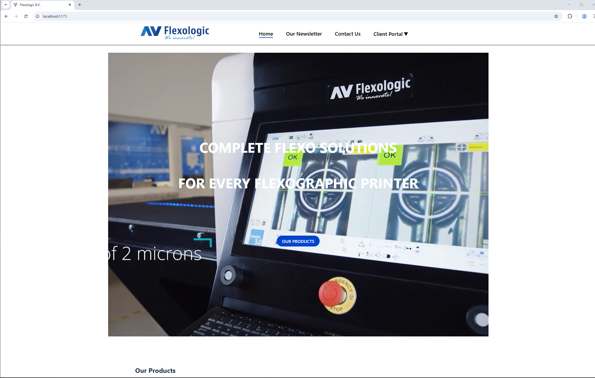

De gebruiker kan omlaag scrollen en krijgt daar meer content te zien van de machines die deze fabrikant aanbiedt. 
In eerste instantie wordt er een korte omschrijving gegeven op de index pagina, de gebruiker kan op de foto of bijbehorende tekst klikken en navigeert dan naar een gedetaileerde pagina met alle product informatie.

## Landings pagina producten:
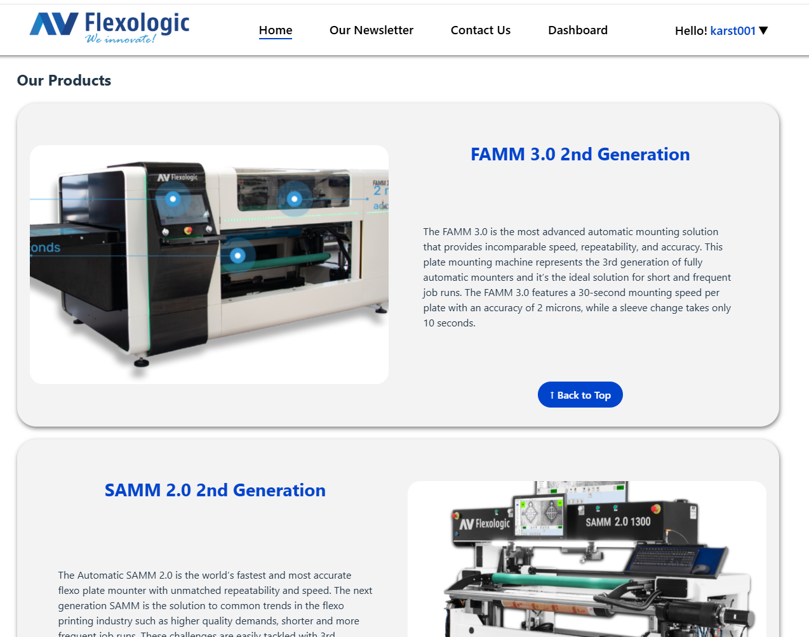

## Nieuwsbrief:
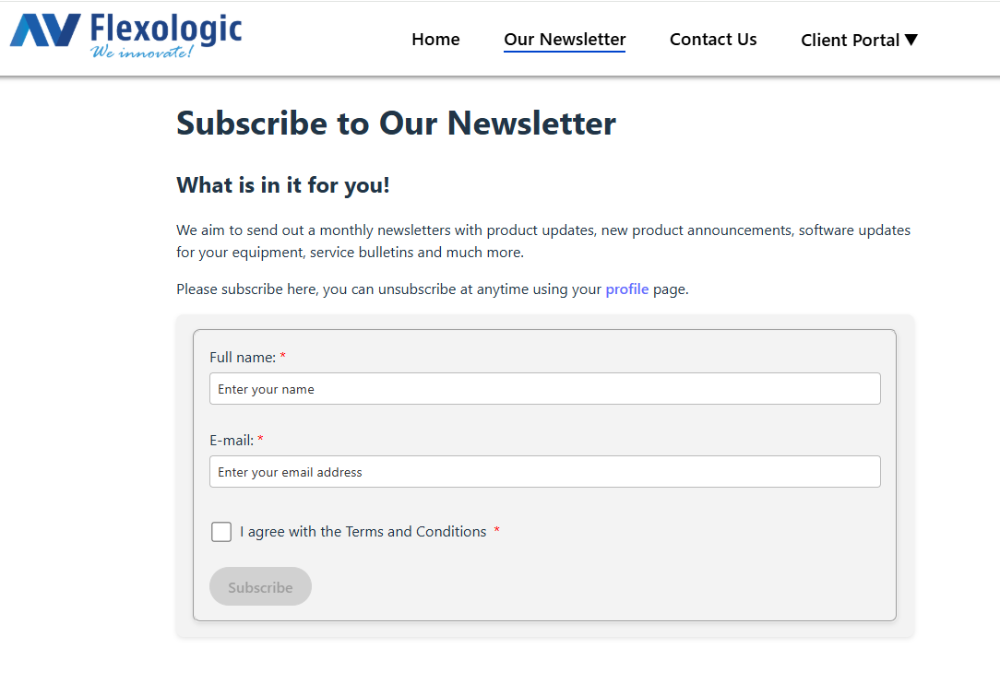

## Contact Us:
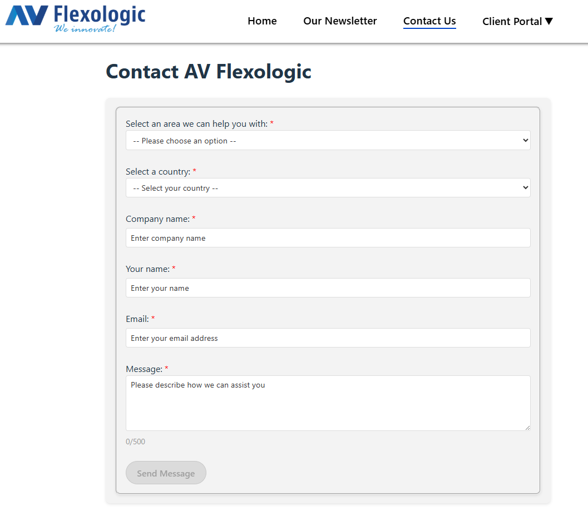

Geregistreerde gebruikers (drukkerijen) hebben een login gekregen. Zij kunnen zelf geen account aanmaken omdat de data in de database voor meerder klanten geldt en daarom kan alleen de administrator een account maken voor de eindgebruikers.

## De Login pagina:
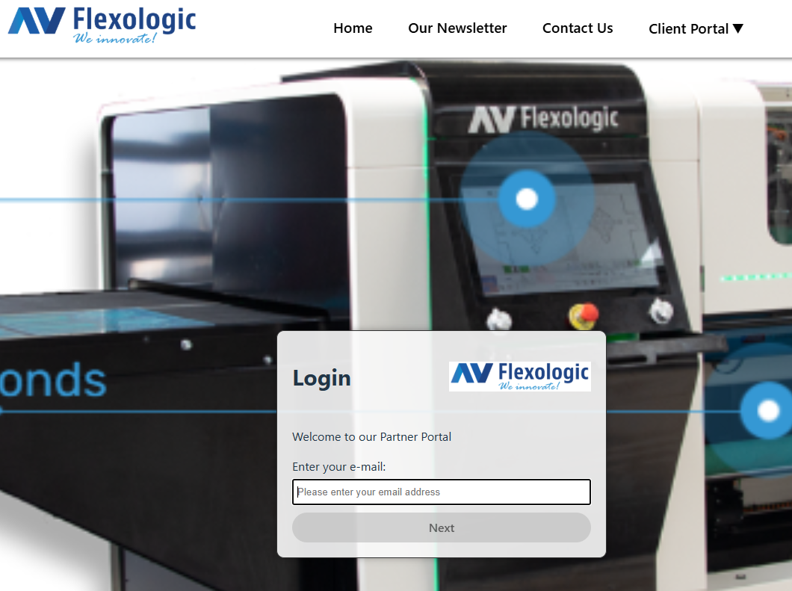

## Wachtwoord pagina: 
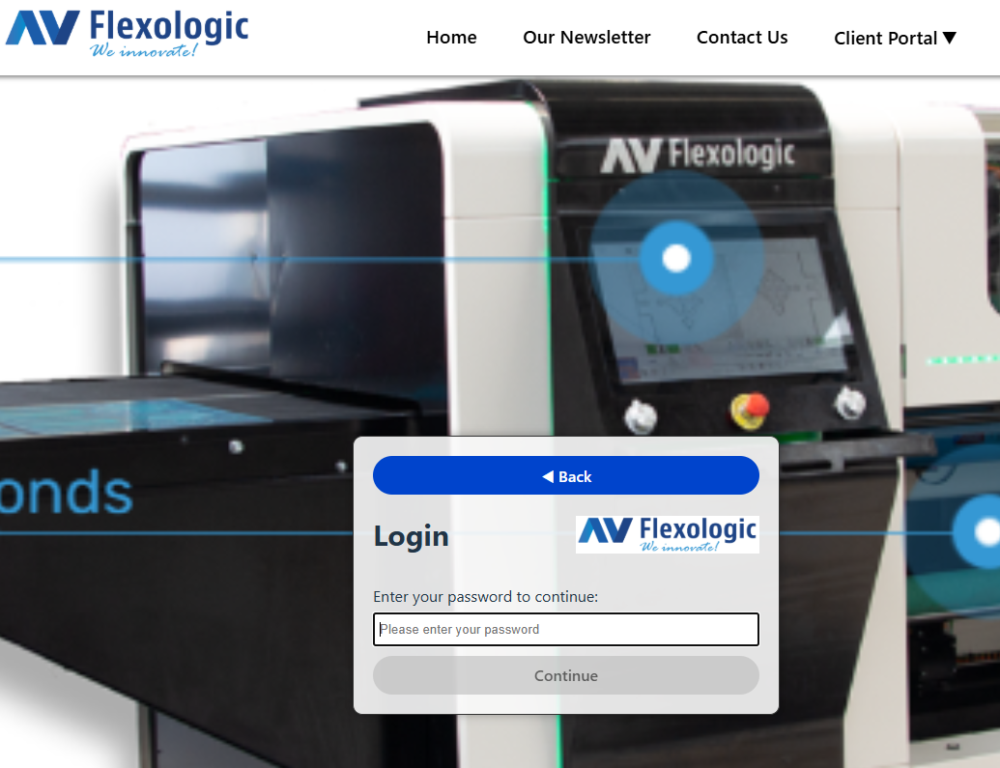

Een drukkerij kan één of meerdere montage machines hebben en iedere machine stuurt montage data naar de API. De configuratie instellingen op de montagemachine zijn dusdanig dat alle machines ongeacht klant of type machine in één gemeenschappelijke database opgeslagen kunnen worden.
Om het zo gebruikersvriendelijk mogelijk te houden kan de gebruiker via een dropdown de machine selecteren. Dit zijn uitereaad alleen de machines van deze drukkerij. 
Als de gebruiker een andere machine selecteerd zal andere data op het dashboard worden weergegeven (door tijdsgebrek is dit helaas niet afgerond).

Zodra de gebruiker is ingelogd zijn de volgende pagina's ter beschikking:
1. Dashboard
2. Performance Analyse;
    1. Total Jobs/Sleeves/Plates
    2. Average Time Between Jobs
    3. Average Time Between Sleeves

Alle donut grafieken zijn zo ingericht dat de data in relatie tot elkaar is berekend.
- Op 1 job kunnen tussen 1 en 8 sleeevs gemonteerd worden en op iedere sleeve kan maximaal 8 platen gemonteerd worden
- Dus in Today's schedule is 142 het hoogste nummer, 66 staat in verhouding tot sleeves and 23 in verhouding tot 66 zodat niet alle drie de donuts een volle circel weergeven
- Zelfde berekening in Mouting Summary

## Dashboard:
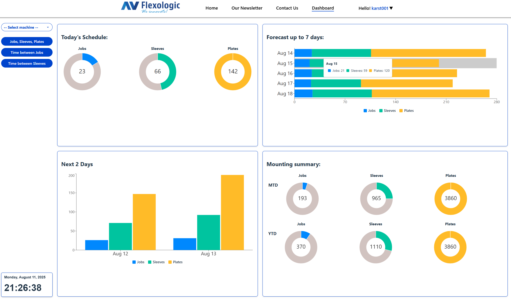

Gedetaileerde informatie per pagina:
1. Dashboard, hier kan de gebruiker het overzicht zien van alle
    1. Jobs die op die dag verwerkt moeten worden (Today's Schedule)
    2. Jobs/Sleeves die gepland staan voor de volgende 2 dagen (dit is gedaan zodat de machine operator kan zien hoe druk het de volgende 2 dagen zal worden)
    3. Forecast van één week vooruit met de geplande orders (met name handig voor Management)
    5. Overzicht van alle verwerkte orders 'YTD Jobs', 'YTD Sleeves', 'YTD Plates' en 'MTD Jobs'


In het linker menu klik op één van de volgende buttons;
## Jobs Sleeves Plates
Dit geeft het onderstaande weer in a grafiek;

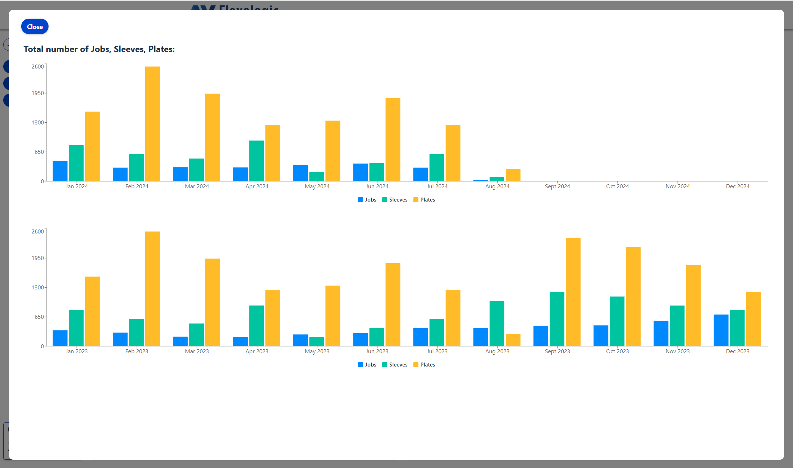

## Jobs Sleeves Plates Sales data by Month
Door in bovenstaande grafiek te klikken op bijvoorbeeld Jan 2024 wordt een nieuwe modal pagina geopend met de volgende grafiek met fictieve data (door tijdsgebrek niet verder ontwikkeld)

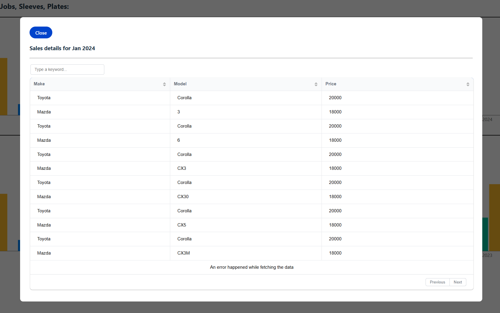


## Time Between Jobs
Geeft de volgende grafiek weer met de gemiddelde tijd in seconden tussen laden van een nieuwe job op de montage machine:

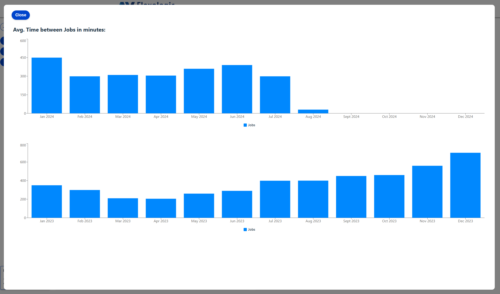


## Time Between Sleeves
Geeft de volgende grafiek weer met de gemiddelde tijd in seconden tussen laden van een nieuwe sleeve op de montage machine:


## Admininstrator pagina.
Als de gebruiker inlogd als Administrator is de volgende pagine beschikbaar;

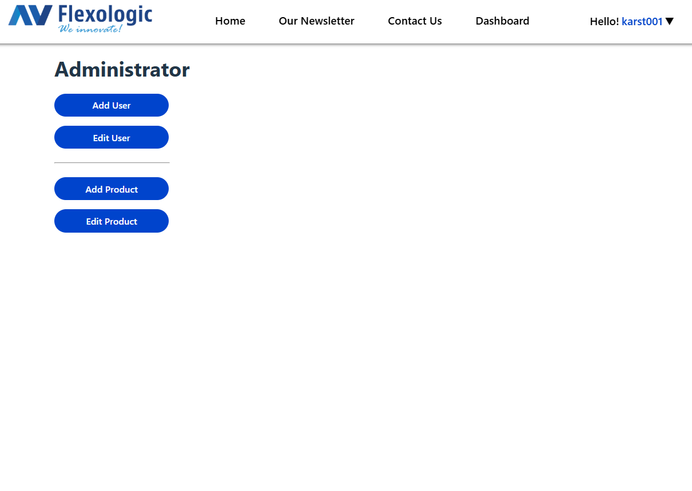

## Nieuwe gebruikers aanmaken:
Klik op Add User om een nieuwe gebruiker aan te maken:
Neem bijvoorbeeld 'karst001' als gebruikersnaam en tab naar het volgende veld, de gebruikersnaam wordt direct gevalideerd.
Zelfde voor het email adres, neem bijvoorbeeld admin@test.com.

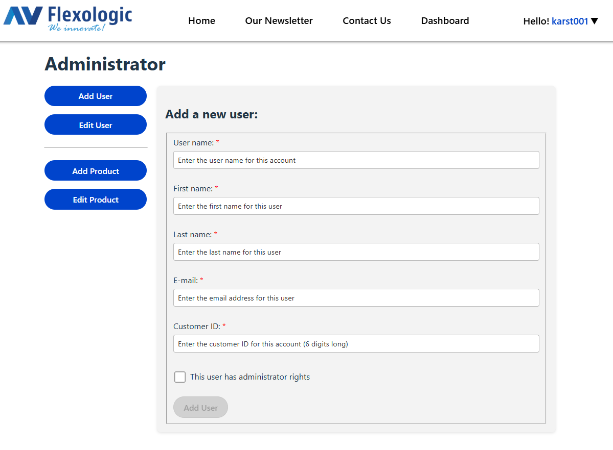


## Bestaande gebruikers wijzigen:
Klik op Edit User om een bestaande gebruiker te wijzigen:

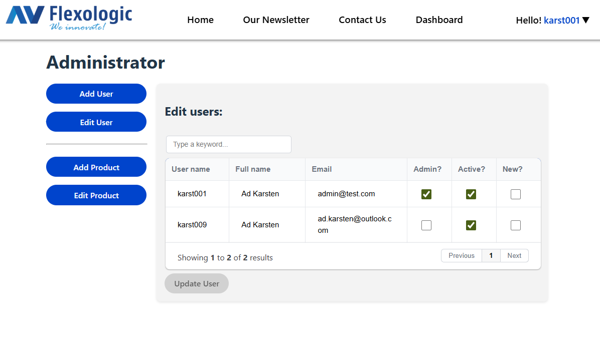

Om een gebruiker opnon-actief te zetten, zet 'Active' uit.  Als een nieuwe gebruiker was aangemaakt en de login moet toch verboden worden, zet 'New' uit.

## Nieuw product aanmaken:
Klik op Add Product om een nieuw product aan de Home pagina toe te voegen:


Zodra een foto geselecteerd wordt kan het beeld nog gecropped worden;

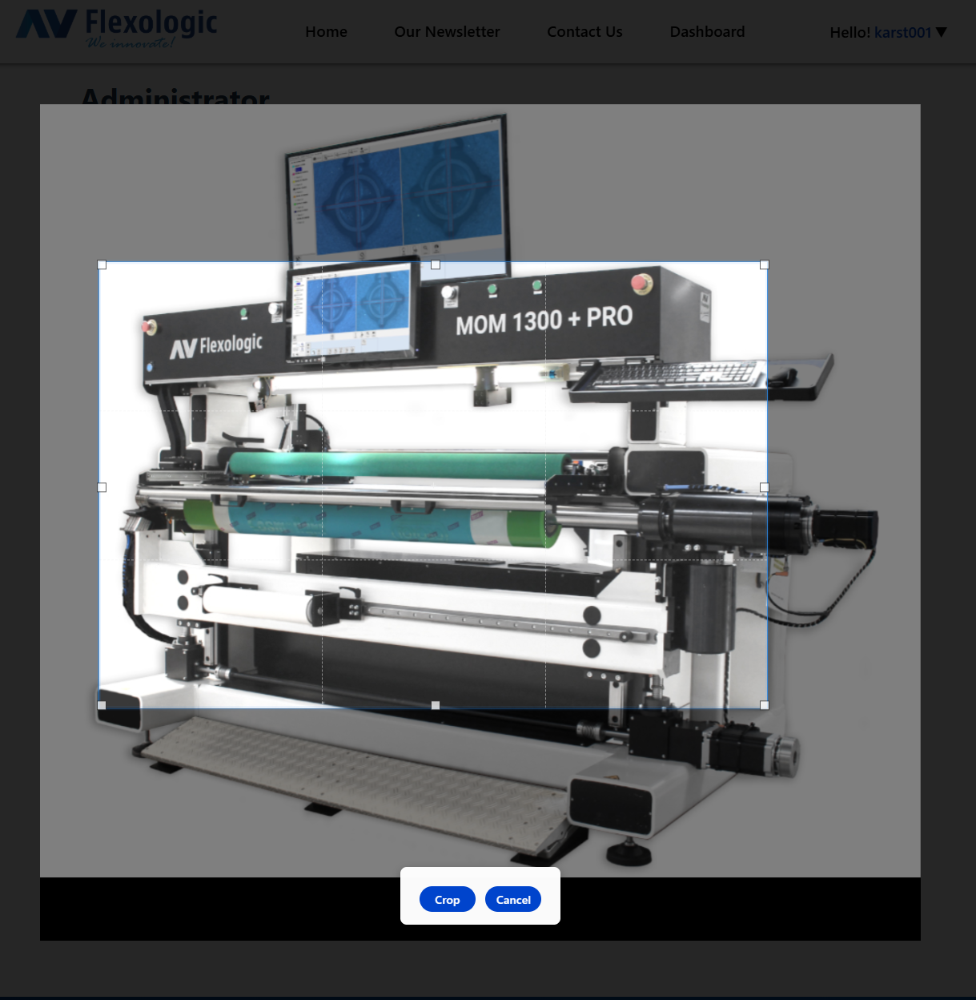

Je kunt in/uitzoomen door met de muis te scrollen en het gewenste crop masker toepassen, druk daarna op crop en het beeld wordt als preview weergegeven.

## Bestaand product wijzigen;
Klik op Edit Product om een bestaand product te wijzigen of te verwijderen van de Home pagina;

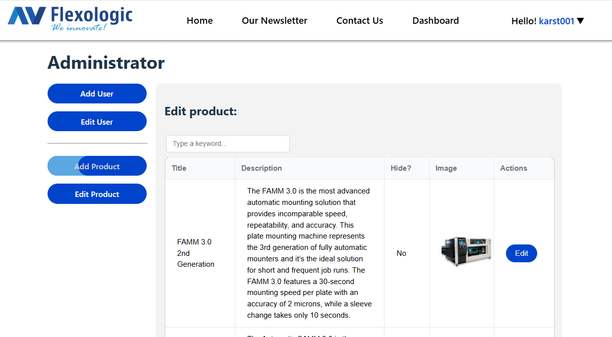


Click op Edit om het product te wijzigen, alles kan in dit scherm gewijzigd worden inclusief de foto en door 'Hide on Home Page' aan te vinken wordt deze niet meer zichtbaar.


## Foutmeldingen:
Probeer het volgende eens uit. 
Navigeer bijvoorbeeld naar Administrator > Edit Product > klik op Edit, rechtermuisklik op Internet in de taakbalk en schakel internet uit.
Na een paar seconden werkt de 'Save' knop niet meer, heeft geen zin want er is geen internet, de Cancel knop werkt nog wel.
Ook wordt er een knipperende melding gegeven.
PS: een knipperende melding is alleen voor Internet storingen, alle andere fouten worden normaal weergegeven.
Zodra internet weer wordt aangezet, gaat de melding weg en komt 'Save' weer terug.

Deze functionaliteit is op alle pagina's ingebouwd.

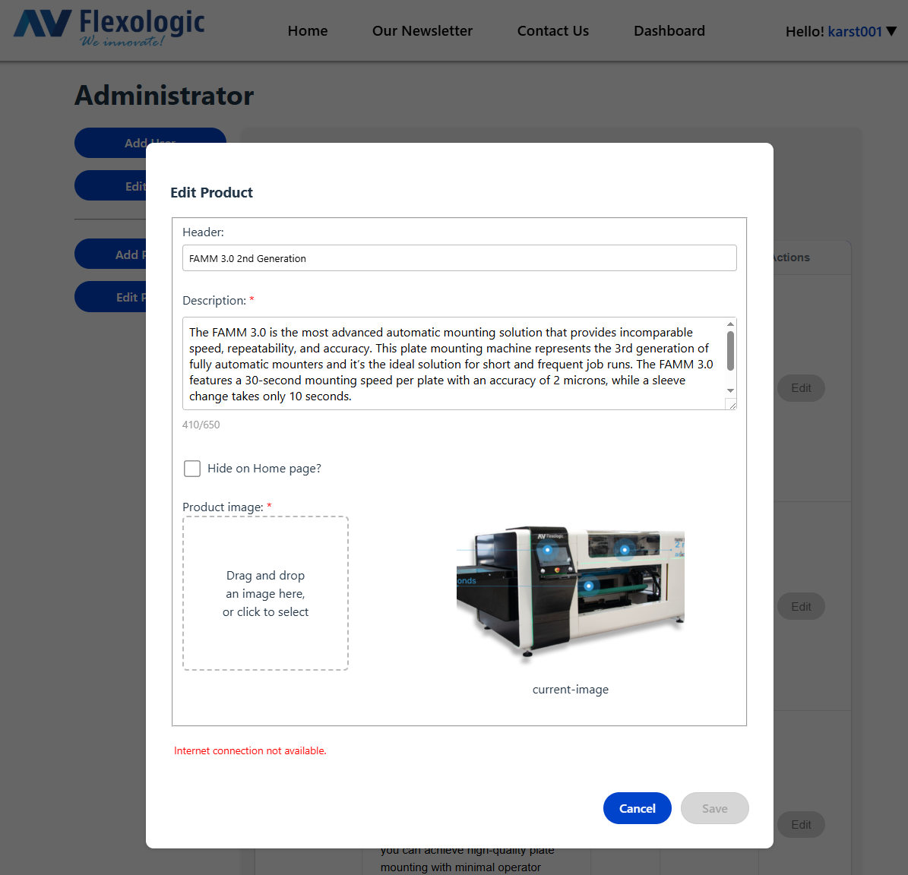