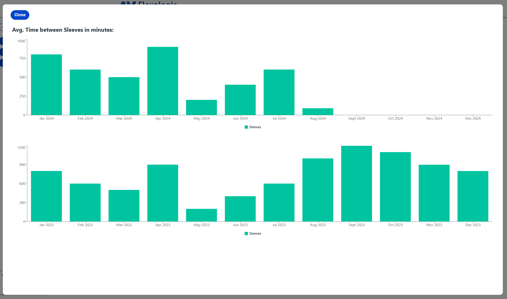

# Opdrachtbeschrijving
1. [Inleiding](#inleiding)
2. [Beschrijving montage machine](#Hoe-werken-deze-machines)
3. [Koppeling ERP systeem](#Koppeling-ERP-systeem)
4. [Kernfunctionaliteiten van de website](#Kernfunctionaliteiten-van-de-website)
5. [API & SQL Backend](#API-en-SQL-Backend)
6. [Environment variable](#Environment-variable)
7. [Applicatie starten](#applicatie-starten)
8. [Admin login gegevens](#Admin-login-gegevens)
9. [Gebruikers handleiding](#applicatie-starten)
- a. [Home pagina & Producten](#Homepagina-met-video-en-producten)
- b. [Nieuwsbrief pagina](#Nieuwsbrief)
- c. [Contact Us pagina](#Contact-Us)
- d. [Login pagina](#De-Login-pagina)
- e. [Wachtwoord pagina](#Wachtwoord-pagina)
- f. [Dashboard pagina](#Dashboard)
- g. [Jobs, Sleeves, Plates](#Jobs-Sleeves-Plates)
- h. [Sales Data by month](#Jobs-Sleeves-Plates-Sales-data-by-Month)
- j. [Avg. Time Between Jobs](#Time-Between-Jobs)
- k. [Administrator pagina](#Admininstrator-pagina)
- l. [Nieuwe gebruikers aanmaken](#Nieuwe-gebruikers-aanmaken)
- m. [Bestaande gebruikers wijzigen](#Bestaande-gebruikers-wijzigen)
- n. [Nieuw product aanmaken](#Nieuw-product-aanmaken)
- o. [Bestaand product wijzigen](#Bestaand-product-wijzigen)
24. [Weergave foutmeldingen](#Foutmeldingen)
25. [Automatisch uitloggen na 15 minuten](#Automatisch-uitloggen)
26. [Test sceanrio's](#TestScenarios)

## Voorwoord:
Ik was al een heel eind met de eindopdracht en aangezien ik nog niet echt gewend ben aan Git Hub had ik dus geen PR en merges gemaakt...
Nieuw project begonnen en stapsgewijs de bestaande structuur en content van het oude project naar dit project gecopieerd dus het lijkt dat ik superman ben en binnen enkele uren heel veel bestanden e.d. gemaakt heb wat dus niet het geval is.

## Project inleiding:
Voor een fabrikant van hoogwaardige montage machines voor de flexo-grafische industrie heb ik een verzoek ontvangen om een webapplicatie te bouwen die data van de montagemachines kan weergeven in diverse grafieken.

De fabrikant levert en installeert deze machines wereldwijd en de eindgebruikers zijn drukkerijen, deze montage machines komen in de zogenaamde 'prepress' te staan om het 
voorbereidende werkt te doen alvorens de rollen 'sleeves' met drukplaten 'plates' de drukpers in gaan. 
Als opdrachten worden verwerkt op de montage machines noemen we deze 'jobs'.
Deze termen zullen in de website te zien zijn omdat de website in het engels opgelevert dient te worden. 

Een drukpers is een zeer geavanceerde machine die op hoge snelheid afdrukken kan maken op bijvoorbeeld melkartonnen, verpakkingen van koekjes, snoep, vuilniszakken e.d.
Als een drukpers eenmaal start zijn er hoge kosten aan verbonden om de pers te stoppen, te denken valt aan arbeidsloon om de pers weer gereed te maken, afval materialen te verwijderen etc. 
Het is daarom van groot belang dat de montage machines 100% functioneren en de plates uiterst nauwkeuring op de sleeves gemonteerd worden.

De klant wil kunnen zien hoeveel jobs, sleevs & plates er per dag verwerkt zijn, dit moet visueel met grafieken worden weergegeven.
Ook willen de gebruikers een home pagina zien, zich voor een nieuwsbrief kunnen inschrijven en uitschrijven, vragen stellen via een contact formulier,hun wachtwoord kunnen wijzigen.

Scenario:
Deze fabrikant ontwerpt en fabriceert montage machines zoals onderstaand is weergegeven:


### Hoe werken deze machines:
De flexibele platen worden gemonteerd op sleeves die vervolgens de drukpers ingaan om af te drukken.

Omdat de consument tegenwoordig hoge eisen stelt aan drukwerk en de verpakking er zeer goed uit moet zien, zijn deze machines ontwikkeld om de flexibele platen met een nauwkeurigheid van 2 micron te plakken op de sleeves. 
Iedere sleeve komt overeen met 1 kleur in de drukpers; de totale combinatie van alle kleuren vormt het uiteindelijke resultaat in de drukpers.

De klant heeft zelf de besturingssoftware ontwikkeld en kan de resultaten van de montagedata uploaden naar een API; zodra een sleeve compleet gemonteerd is wordt de API aangestuurd 
vanuit de machine.
Ook kan de klant data uploaden naar de API als het gaat om de hoeveelheid orders die per dag verwerkt moeten worden, en een forecast van orders voor de komen week.
De machine-operator kan zo zien wat van hem/haar wordt verwacht die dag en dagen daarna. Het managementteam kan dit te allen tijde ook zien, immers het is een website.

Aangezien de te ontwikkelen website de machine niet kan aansturen heeft de klant een API met Microsoft SQL Server backend beschikbaar gesteld waar al veel data in is opgeslagen.
Deze data dient weergegeven te worden in grafieken op de website.

### Koppeling ERP systeem:
Het ERP systeem van de klant zal in de toekomst data aanleveren aan de website m.b.t. de hoeveelheid orders die per dag verwerkt moeten worden.
Aangezien dit ERP systeem nu nog niet beschikbaar is, gebruiken we een JSON dataset met willekeurige waarden die we oploaden naar de API zodat de website de data vervolgens kan 
weergeven in grafieken om de functionaliteit te kunnen weergeven.
In de website wordt iedere 5 sec nieuwe willekeurige data opgehaald voor het dashboard.
Hetzelfde doen we voor het aantal orders voor de volgende week zodat het management team en de machine operators kunnen zien wat de verwachte werkdruk zal zijn.


## Kernfunctionaliteiten-van-de-website:
### _31 Functionele eigenschappen van de Dashboard applicatie_
1.	Aanmaken gebruikers alleen door de administrator
2.	Wijzigen van bestaande gebruikers
3.	Geautomatiseerde email met uitnodiging voor nieuwe gebruikers
4.	Registratie n.a.v. bovenstaande email inclusief aanmaken wachtwoord door nieuwe gebruiker
5.	Wijzigen van wachtwoord voor geregistreerde gebruikers via profiel pagina
6.	Gebruikers inlog
7.	Login moet middels twee stappen worden uitgevoerd; eerst email verificatie in het backend, als dat voldoet dan wachtwoord invoeren.   Login wordt alleen toegestaan als email en wachtwoord overeenkomen met de database. Op dat moment wordt een JWT afgegeven door het backend
8.	Contactformulier
9.	Zodra de gebruiker het contactformulier invult dan wordt dit bevestigd met een geautomatiseerde email aan de gebruiker
10.	Nieuwsbriefinschrijving
11.	Zodra de gebruiker zich voor een nieuwsbrief inschrijft dan wordt dit bevestigd met een geautomatiseerde email aan de gebruiker
12.	Nieuwsbriefuitschrijving via profiel pagina als een gebruik is ingelogd
13.	Admin paneel voor websitebeheerders
14.	Aanmaken nieuwe producten die dynamisch op de hoofdpagina worden weergegeven
15. Wijzigen bestaande producten, tekst en afbeeldingen
16.	Na 15 minuten automatisch uitloggen van een gebruiker als er geen activiteit is
17.	Dashboard voor weergave data na inloggen geregistreerde gebruiker
18.	Dashboard update data iedere 5 seconden
19.	Als de internetverbinding wordt verbroken ziet de gebruiker een foutmelding 'Internet connection not available'
20. Als de internetverbinding wordt verbroken kan de gebruiker nog wel navigeren op de website maar opslaan van data bijvoorbeeld wordt geblokkeerd. Dit voorkomt onnodige foutmeldingen en mogelijke frustratie bij de gebruiker
21.	De dashboard-, profiel-, en adminpagina zijn beveiligde URL’s dat betekend dat er geen toegang is zonder ingelogd te zijn
22.	Als een gebruiker een URL zou intoetsen zoals …../profiel of …./admin dan zal de website dit negeren en direct naar de login pagina navigeren
23.	Op de gehele website is validatie van invoervelden generiek; er wordt een controle gedaan terwijl er getypt wordt, bijvoorbeeld, als er 'admin@ getypt is kun de gebruiker al zien dat het email formaat nog niet juist is'. 
Persoonlijk vind ik het super irritant om als gebruiker eerst alles in te vullen, dan 'Next' te drukken en er diverse foutmeldingen kunnen komenomdat het emailadres bijvoorbeeld niet juist is of de naam te kort is; mijn voorkeur is dat de fout gelijk wordt weergegeven terwijl je typt.  
24. De knoppen worden pas beschikbaar gesteld als de validatie juist is, in dit geval een email adres:

    

26. Als de gebruiker zijn/haar wachtwoord wijzigt, dan wordt dit bevestigd met een geautomatiseerde email
26. Nieuwe wachtwoorden mogen niet hetzelfde zijn als oude wachtwoorden
27.	Het valideren van emailadressen is aan regels gebonden:
- a.	n.eeken@novi.nl is juist
- b.	tessmellink@novi.nl is juist
- c.	n.eekenanovi.nl is **niet** juist, geen ‘@’ symbool
- d.	n.eeken@novi.nl. is **niet** juist, geen ‘ . ’ op het einde
- e.	tessmellink@novi,nl is **niet** juist, geen ‘ , ‘ in een emailadres
- f.	Alle speciale karakters zijn **niet** toegestaan in een emailadres, m.u.v. het ‘@’ symbool
28.	De website moet afbeeldingen kunnen importen, in- en uit zoomen en croppen voordat ze worden opgeslagen in de database
29.	De afbeeldingen moeten ook gecomprimeerd worden opgeslagen in de database
30.	De website moet gebruik maken van een API en SQL Database back-end
31.	Als een gebruiker een URL intoetst die niet bestaan komt er een ‘404 Page not found’ foutmelding


### _28 Niet functionele eigenschappen van de Dashboard applicatie_
1.	Website maakt geen gebruik van Jason Web Tokens (JWT) als een user een contactformulier invult, immers dit is een publiekelijk beschikbaar formulier niet alleen voor ingelogde gebruiker
2.	Website maakt geen gebruik van Jason Web Tokens (JWT) tijdens het inschrijven voor een nieuwsbrief, het zou kunnen zijn dat een potentiële klant eerst meer wil weten via een nieuwsbrief en dus nog geen login heeft
3.	Website maakt geen gebruik van Jason Web Tokens (JWT) tijdens inloggen en registratieproces van een nieuwe gebruiker
4.	De backend voert een controle uit a.d.h.v. email en wachtwoord, als deze overeenkomen met de gegevens in de database, krijgt de gebruiker toegang en wordt een JWT naar het front-end verzonden
5.	Alle transacties waar beveiligde data gelezen of geschreven moet worden, wordt gebruik gemaakt van een JWT. Beveiligde transacties zijn aanmaken nieuwe gebruikers, wijzigen van bestaande gebruikers, wijzigen wachtwoord, uploaden van nieuwe producten en wijzigen van bestaande producten
6.	De JWT is maar 5 minuten geldig en het front-end vernieuwd de JWT op tijd.  Er zal nooit een verlopen token naar de backend worden verzonden om daar mee een nieuwe te krijgen, dit is een hack gevoelige praktijk
7.	Alle wachtwoorden zijn versleuteld opgeslagen in de database
8.	Als tijdens het inloggen een verkeerd wachtwoord wordt gebruikt dan zal nadat de melding ‘Login failed. Please check your credentials’ zichtbaar wordt, ook het wachtwoord veld gereset worden
9.	Compatibiliteit met browsers (Chrome, Edge) en volledig getest
10.	Mobiele responsiviteit
11.	Vlotte en gebruiksvriendelijkheid interface
12.	Consistente huisstijl
13.	Verantwoordings documentatie aanwezig voor ontwikkelaars, ook veel commentaar binnen de broncode zelf
14.	Herbruikbaarheid van componenten/modules/helpers/hooks
15.	Eenvoudig uitbreidbaar met nieuwe functionaliteit door componenten te hergebruiken
16.	Veilige sessie-afhandeling, JWT en token data wordt verwijderd bij uitloggen en wanneer website automatisch uitlogt
17.	Gebruik gemaakt van open source libraries voor snellere ontwikkeling van datagrid, grafieken en werken met afbeeldingen
18.	De homepagina moet een bedrijfsvideo laten zien die continue draait en opnieuw start als de video compleet is
19.	De gehele website moet in de Engelse taal zijn opgebouwd
20.	Als de gebruiker navigeert op de website dan ‘springt’ de link waarop werd geklikt een paar keer op en neer
21.	De huisstijl van de website is blauwe navigatie balk- en footer, lichtgrijze achtergrond
22.	Alle knoppen zijn blauw met witte tekst, als de muis over de knop beweegt veranderd de achtergrond kleur van de knop van donkerblauw naar lichtblauw d.m.v. een animatie van links naar rechts
23.	Op de homepagina worden producten dynamisch weergegeven, d.w.z. geladen uit de database niet statisch gecodeerd
24.	De producten op de homepagina worden geanimeerd weergegeven; het eerste product komt van links, de tweede van rechts, derde weer van links etc
25.	De animatie van de producten op de homepagina is hetzelfde voor desktop en mobiele browsers
26.	Op niet mobile pagina’s worden de producten en bijbehorende tekst als volgt opgemaakt; eerst de afbeelding, dan introductie en omschrijving, het tweede product eerst introductie, omschrijving en dan afbeelding, derde product als eerste, etc
27.	Op mobiele pagina’s is de opmaak als volgt; eerst afbeelding, dan introductie, dan omschrijving
28.	Als de website data verwerkt dat moet er een ‘spinner’ worden weergegeven zodat de gebruiker weet dat de website bezig is


## API en SQL-Backend
De backend bestaat uit een Microsoft SQL Server Database met Stored Procedures en een een API geschreven in C#. de documentatie kan gevonden worden op https://www.softwarethatworks.ca/novi-dashboard/swagger

Er is geen projectID nodig voor het gebruiken van de API, 

## Environment variable:
- Maak in de root map (op dezelfde hoogte als de .gitignore en package.json) een .env file aan.
- Voeg het woord .env toe aan het .gitignore bestand
- Open de .env en plaats daar de volgende keys:
- VITE_BASE_URL= {de waarde van de base URL kun je vinden in document 'Beschrijving bestanden Dashboard Applicatie.pdf'}
- Run het commando npm run build in de terminal; dit is nodig omdat het env bestand gewijzigd is
- stop nu de development server met CNTR + C
- herstart de server met npm run dev

## Applicatie starten:
Als je het project gecloned hebt naar jouw locale machine, installeer je eerst de `node_modules` door het volgende
commando in de terminal te runnen:

```shell
npm install
```
of gebruik de WebStorm knop (npm run dev). Open http://localhost:5173 om de website in de browser te bekijken.


## Admin login gegevens:
Om in te kunnen loggen volg deze stappen:
- navigeer naar 'Client Portal > Sign In'
- login met 'admin@test.com' en 'Welc0me64!@'
- in hoofdstuk 26 van dit document zijn diverse test scenario's te vinden


## Gebruikers handleiding:
Zodra website start kom je op de indexpagina, hierop is een video te zien met daaronder producten die het bedrijf verkoopt.


De gebruiker kan omlaag scrollen en krijgt daar meer content te zien van de machines die deze fabrikant aanbiedt. 


## Homepagina met video en producten:


## Nieuwsbrief:


## Contact Us:


Geregistreerde gebruikers (drukkerijen) hebben een login gekregen. Zij kunnen zelf geen account aanmaken omdat de data in de database voor meerder klanten geldt en daarom kan alleen de administrator een account maken voor de eindgebruikers.
Als een gebruiker zelf een account kon aanmaken dan kunnen ze namelijk ieder gewenst account nummer opgeven om op die manier toegang te krijgen tot dat van andere drukkerijen wat niet gewenst is.


## De Login pagina:


## Wachtwoord pagina: 


Een drukkerij kan één of meerdere montage machines hebben en iedere machine stuurt montage data naar de API. De configuratie instellingen op de montagemachine zijn dusdanig dat alle machines ongeacht klant of type machine in één gemeenschappelijke database opgeslagen kunnen worden.
Om het zo gebruikersvriendelijk mogelijk te houden kan de gebruiker via een dropdown de machine selecteren. Dit zijn uitereaad alleen de machines van deze drukkerij. 
Als de gebruiker een andere machine selecteerd zal andere data op het dashboard worden weergegeven (door tijdsgebrek is dit helaas niet afgerond).

Zodra de gebruiker is ingelogd zijn de volgende pagina's ter beschikking:
1. Dashboard
2. Performance Analyse;
    1. Total Jobs/Sleeves/Plates
    2. Average Time Between Jobs
    3. Average Time Between Sleeves

Alle donut grafieken zijn zo ingericht dat de data in relatie tot elkaar is berekend.
- Op 1 job kunnen tussen 1 en 8 sleeevs gemonteerd worden en op iedere sleeve kan maximaal 8 platen gemonteerd worden
- Dus in Today's schedule is 142 bijvoorbeeld het hoogste nummer, 66 staat in verhouding tot sleeves and 23 in verhouding tot 66 zodat niet alle drie de donuts een volle circel weergeven
- Zelfde berekening in Mouting Summary


## Dashboard:


Gedetaileerde informatie per pagina:
1. Dashboard, hier kan de gebruiker het overzicht zien van alle
    1. Jobs die op die dag verwerkt moeten worden (Today's Schedule)
    2. Jobs/Sleeves die gepland staan voor de volgende 2 dagen (dit is gedaan zodat de machine operator kan zien hoe druk het de volgende 2 dagen zal worden)
    3. Forecast van één week vooruit met de geplande orders (met name handig voor Management)
    5. Overzicht van alle verwerkte orders 'YTD Jobs', 'YTD Sleeves', 'YTD Plates' en 'MTD Jobs'


In het linker menu klik op één van de volgende buttons;
## Jobs Sleeves Plates
Dit geeft het onderstaande weer in a grafiek;


## Jobs Sleeves Plates Sales data by Month
Door in bovenstaande grafiek te klikken op bijvoorbeeld Jan 2024 wordt een nieuwe modal pagina geopend met de volgende grafiek met fictieve data (door tijdsgebrek niet verder ontwikkeld)


## Time Between Jobs
Geeft de volgende grafiek weer met de gemiddelde tijd in seconden tussen laden van een nieuwe job op de montage machine:


## Time Between Sleeves
Geeft de volgende grafiek weer met de gemiddelde tijd in seconden tussen laden van een nieuwe sleeve op de montage machine:




## Admininstrator pagina.
Als de gebruiker inlogd als Administrator is de volgende pagine beschikbaar;


## Nieuwe gebruikers aanmaken:
Klik op Add User om een nieuwe gebruiker aan te maken:
Neem bijvoorbeeld 'karst001' als gebruikersnaam en tab naar het volgende veld, de gebruikersnaam wordt direct gevalideerd.
Zelfde voor het email adres, neem bijvoorbeeld admin@test.com.


## Bestaande gebruikers wijzigen:
Klik op Edit User om een bestaande gebruiker te wijzigen:


Om een gebruiker opnon-actief te zetten, zet 'Active' uit.  Als een nieuwe gebruiker was aangemaakt en de login moet toch verboden worden, zet 'New' uit.


## Nieuw product aanmaken:
Klik op Add Product om een nieuw product aan de Home pagina toe te voegen:


Zodra een foto geselecteerd wordt kan het beeld nog gecropped worden;


Je kunt in/uitzoomen door met de muis te scrollen en het gewenste crop masker toepassen, druk daarna op crop en het beeld wordt als preview weergegeven.


## Bestaand product wijzigen;
Klik op Edit Product om een bestaand product te wijzigen of te verwijderen van de Home pagina;


Click op Edit om het product te wijzigen, alles kan in dit scherm gewijzigd worden inclusief de foto en door 'Hide on Home Page' aan te vinken wordt deze niet meer zichtbaar.


## Foutmeldingen:
Probeer het volgende eens uit. 
Navigeer bijvoorbeeld naar Administrator > Edit Product > klik op Edit, rechtermuisklik op Internet in de taakbalk en schakel internet uit.
Na een paar seconden werkt de 'Save' knop niet meer, heeft geen zin want er is geen internet, de Cancel knop werkt nog wel.
Ook wordt er een knipperende melding gegeven.
PS: een knipperende melding is alleen voor Internet storingen, alle andere fouten worden normaal weergegeven.
Zodra internet weer wordt aangezet, gaat de melding weg en komt 'Save' weer terug.

Deze functionaliteit is op alle pagina's ingebouwd.


## Automatisch uitloggen:
De website heeft een functionaliteit waarbij na een tijdsbestek van meer dan 15 minuten een ingelogde gebruiker automatisch wordt uitgelogd als de gebruiker niet actief is op de website.
Met niet actief wordt verstaan, geen actie op toetsenbord, muis klik of muisbewegingen.

In ../context/AuthContextProvider.jsx zijn de tijden alsvolgt  in stellen
- const auto_logout_time = 15 * 60 * 1000;       // Auto logout after 15 minutes of inactivity
- const warning_before_signout = 10 * 1000;     // Show warning 10s before logout

Om dit snel te testen wijzig const auto_logout_time = 10 * 60 * 1000 naar const auto_logout_time = 1 * 30 * 1000 en binnen 30 seconden inactief te zijn logt de website uit.

De gebruiker krijgt dan onderstaande melding te zien 10 seconden voordat de tijd is verstreken:


## TestScenarios:
Test scenario’s voor de Dashboard applicatie

### **1) Start de website in Webstorm**
      
- a.	De homepagina zal een video weergeven en animatie vertonen met tekst en een knop ‘Products’
- b.	De producten kunnen op twee manieren worden weergegeven: klik op knop ‘Products’ of scroll naar beneden
- c.	De video zal langzaam naar de achtergrond verdwijnen en de producten zullen geanimeerd weergegeven worden
- d.	Klik op ‘Back to top’ om weer naar de video te gaan


### **2) Our Newsletter**

- a.	Klik op ‘Our Newsletter’
- b.    Als je bent ingelogd dan wordt het e-mailadres al ingevuld, als je niet bent ingelogd dan moet je naam en emailadres invullen, akkoord gaan met de voorwaarden en op ‘Subscribe’ te klikken
- c.	Een geautomatiseerde email wordt via de API naar je verzonden ter bevestiging
- d.	Zodra je je hebt aangemeld verdwijnt de knop ‘Our Newsletter’ in de navigatie balk
- e.	Als je al bent ingeschreven en je probeert het opnieuw met hetzelfde email adres dan zie je deze melding 'This emailaddress is already subscribed'.
- f.	Verbreek nu de verbinding met het internet, na een paar seconden zal er aan melding gaan knipperen ‘Internet connection not available’
- g.	Vul een naam en emailadres in en ga akkoord met de voorwaarden terwijl het internet nog uitstaat. Je zult zien dat de ‘Subscribe’ knop uitblijft
- h.	Schakel nu internet weer in, wacht een paar seconden, ‘Subscribe’ wordt weer actief
- i.	In Console.log() wordt de data gelogd, ook in de database via de API-call wordt de data opgeslagen
- j.	De ‘test internet status’ is en functie die door de gehele website werkt

### **3) Contact Us**
- a.    Klik op ‘Contact Us’
- b.	Vul alle velden in
- c.	Controleer of email gevalideerd wordt
- d.	Klik op ‘Send’ Message, zie console.log() voor output
- e.	Een geautomatiseerde email wordt via de API naar je verzonden ter bevestiging

### **4) Client Portal**
- a.    Klik op ‘Client Portal’ --> ‘Sign In’
- b.	Vul voor emailadres ‘test@test.com’ in, deze bestaat nog niet, er zal een foutmelding ontstaan ‘Unknown email’
- c.	Probeer opnieuw met 'testatest.nl.' -> foutmelding ‘Invalid email format’
- d.	Probeer opnieuw met 'admin@test/nl' -> foutmelding ‘Invalid email format’
- e.	Probeer opnieuw met 'admin@test.com'
- f.	Wachtwoord: ‘Welc0me64!’  (geen O maar een nul)
- g.	Omdat dit de administrator is wordt de administrator pagina weergegeven om een gebruiker aan te maken, te wijzigen, product aan te maken en te wijzigen
- h.	Test ‘Add user’, vul bijvoorbeeld ‘karst001’ in en tab naar volgend veld -> foutmelding ‘The username is already in use’ wijzig nu naar iets anders
- i.	Zelfde validatie voor email adres als deze al bestaan zoals admin@test.com
- j.	Vul nu je eigen emailadres in, je krijgt zo dadelijk een email met link om account aan te maken, controleer je spam box ook
- k.	Vul een customerID in, maakt niet uit wat, maar wel 6 cijfers, tekst niet toegestaan
- l.	Klik op ‘Add User’, gebruiker is nu aangemaakt in afwachting van registratie door de eindgebruiker, de API stuurt een email naar je toe

### **5) Test nieuwe gebruiker**

- a.	Probeer nu met het emailadres wat je net hebt opgegeven in te loggen, er komt een foutmelding dat de gebruiker nog niet is geregistreerd
- b.	Sluit de web browser maar laat Webstorm draaien
- c.	Zodra de email binnen komt klik op de link, deze opent de webpagina weer, vul nu een emailadres is dat anders is wat je hiervoor hebt opgegeven -> fout ‘The email address you entered is not correct.’
- d.	Vul nu het juiste emailadres in
- e. 	Je komt nu op ‘Set new Password’ en vul wachtwoord in, er zijn meldingen waaraan je wachtwoord moet voldoen
- f.	Maak wachtwoord aan en bevestig, een welkom bericht komt tevoorschijn, als niet admin gebruiker zie je daarna direct je dashboard
- g.	In de navigatie balk klik nu op Hello! {gebruikernaam} -> Profile
- h.	Hier kun je je wachtwoord wijzigen en ook inschrijven voor de nieuwsbrief of als je al ingeschreven bent, weer uitschrijven
- j.	Als je je wachtwoord wijzigt wordt ook een controle uitgevoerd of het huidige wachtwoord correct is, zodra wachtwoord gewijzigd is zal de API een bevestiging emailen

### **6) Dashboard**
Ga terug naar ‘Dashboard’, iedere 5 seconden wordt deze aangepast met fictieve data
- a.	Klik op ‘Jobs, Sleeves Plates’, een nieuw menu wordt zichtbaar, klik op ‘Jan 2024’ en nog een nieuw menu wordt zichtbaar. Door tijdsgebrek is dit nu alleen fictieve data
- b.	Sluit menu en klik op ‘Feb 2024’, andere data wordt nu weergegeven
- c.	Terwijl deze popup menu’s open zijn wordt het Dashboard niet ge-refreshed in de achtergrond
- d.	Ga terug naar ‘Dashboard’, klik op ‘Time Between Jobs’ of ‘Time Between Sleeves’, verschillende grafieken worden weergegeven

### **7) Log uit**
- a.	Login nu in met 'admin@test.com' en 'Welc0me64!'
- b.	Ga naar Hello! {gebruikernaam} -> Administrator

### **8) Edit users**
- Klik nu op ‘Edit users’, je ziet karst001 en de gebruiker die je net hebt aangemaakt, nu kun je de rechten wijzigen en opslaan middels’ Update User’.
- Een gebruiker die op Enabled stond kun je uitzetten, hierna kan de gebruiker niet meer inloggen. S
- Stel dat je een gebruiker had aangemaakt en de gebruiker heeft zich nog niet aangemeld via de emailregistratie, dan kun je alsnog de gebruiker blokkeren d.m.v. ‘New User?’ uit te zetten

### **9) Add Products**
Er staat maar 1 product op de homepagina, voeg er nog drie aan toe
- a.	Klik op ‘Add Product’, ga naar de folder ‘..\5-Product foto's en tekst’, copieer de tekst uit ReadMe.txt en upload bijbehorende foto die beschreven in dit document
- b.	Je kunt in-en uit zoomen op de foto met scrollen van de muis, en croppen, klik op Apply
- c.	Klik op ‘Create Product’, de data wordt nu inde database opgeslagen

 
Ga nu naar ‘Home’, nu zijn er twee producten
- a.	Ga terug naar Hello! {gebruikernaam} -> Administrator
- b.	Voeg de andere twee producten toe, controleer homepagina, er zijn er nu vier
- c.	In Hello! {gebruikernaam} -> Administrator ga naar ‘Edit Product’
- d.	Klik op ‘Edit’ naast 1 van de producten
- e.	Klik op ‘Hide on Home page? Klik op ‘Save’

Kijk nu op homepagina, dit product is nu niet meer zichtbaar

### **10) Klik maar raak**
Doe ook maar eens ‘klik maar raak voor een knaak’ en zie of je de website kan crashen en of er foutmeldingen zijn.

Veel succes met testen.
